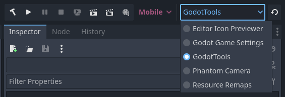

# godot-plugin-refresher

This plugin simplifies plugin development for those wanting to make tools for the Godot Editor.

> The `master` branch supports Godot 4.2+. For Godot 4.0-4.1, see the `4.0` branch. For Godot 3, see the `3.x` branch.

The plugin adds a dropdown and refresh button to the main toolbar in the top-right corner of the Godot Editor. *Other* plugins' names will show up in the dropdown. Clicking the refresh button will toggle the plugin off and then back on. Disabled plugins still appear in the list & be toggleable (effectively just enabling them), but will ask to confirm beforehand.

Here's an example of working on a WIP internal "GodotTools" plugin amidst an in-development project:

This makes it much easier to iterate on a single plugin since rather than having to...

1. Click Project Settings.
2. Go to Plugins tab (first time).
3. Find the desired plugin.
4. Click the dropdown.
5. Select the opposite option.
6. Click the dropdown again.
7. Click the original option.
8. Close the Project Settings.

You instead just...

1. Click the dropdown (first time).
2. Select your WIP plugin (first time).
3. Click the refresh button.

Please consider starring the repo if you like the project and let me know if you have any feedback for bugs / feature improvements in the Issues. If you'd like to support my work, please [send tips to my Kofi](https://ko-fi.com/willnationsdev). Cheers!
